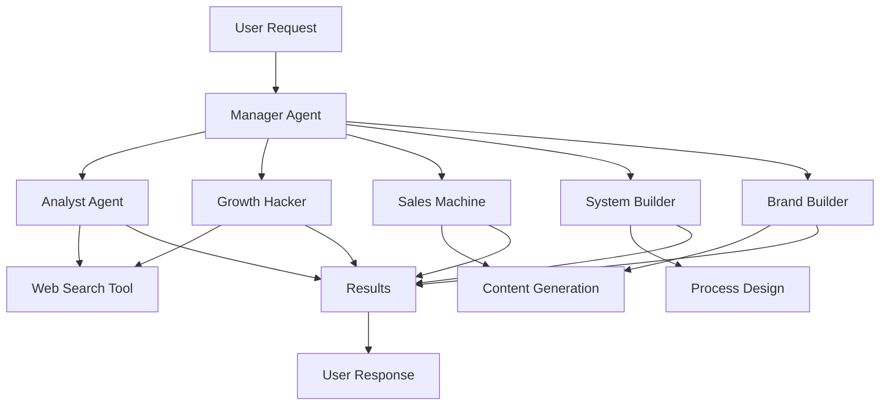

# 🎨 GitHub Profile & Repository Optimization Guide

## Overview
Transform your GitHub presence into a professional portfolio that showcases your resume, projects, and AI expertise. This guide provides actionable steps to create a well-designed GitHub account that attracts recruiters and demonstrates your skills.

---

## 🎯 Goals

✅ Professional GitHub profile that showcases your experience
✅ Clear, compelling repository descriptions
✅ Well-organized projects with proper documentation
✅ SEO-optimized for recruiter searches
✅ Social proof through stars, forks, and activity

---

## 📸 Part 1: GitHub Profile Optimization

### **1.1 Create a Profile README**

GitHub displays a special README when you create a repository with your username.

**Step-by-step:**

1. Create new repository: `avaluev` (same as your username)
2. Make it public
3. Add README.md with your profile content

**Example Profile README:**

```markdown
# 👋 Hi, I'm Alex Valuev

## 🚀 Senior AI Product Manager | Healthcare AI • FinTech • MedTech

I build AI-powered products that ship. **11+ years** transforming complex problems into scalable systems across healthcare, finance, and technology.

### 🎯 What I Do
- 🏥 **Healthcare AI**: Scaled AI clinical recommendations to 100K+ patients
- 🤖 **Multi-Agent Systems**: Built autonomous AI teams using Claude Sonnet 4.5
- 📊 **Data Products**: Created ML platforms reducing deployment cycles by 75%
- 💼 **Product Leadership**: Led 50+ person teams shipping $4M+ products

### 🛠️ Tech Stack
```
AI/ML: Claude, GPT-4, Gemini, LangChain, RAG, Multi-Agent Systems
Data: SQL, BigQuery, MongoDB, ELK, Tableau
Product: Figma, A/B Testing, Analytics, Roadmapping
Tech: Python, FastAPI, Docker, GCP, AWS
```

### 📊 Featured Projects

🤖 **[Autonomous AI Dream Team](https://github.com/avaluev/avaluev.github.io/tree/master/autonomous-ai-team)**
Multi-agent AI system coordinating 5 specialized agents for business growth. Built with Claude Sonnet 4.5, FastAPI, Docker.

### 📫 Connect With Me

- 💼 [LinkedIn](https://linkedin.com/in/valuev)
- 📧 [Email](mailto:valuev.alexandr@gmail.com)
- 🎓 [Career Coaching](https://t.me/itcareertech)
- 🎥 [YouTube](https://youtube.com/@itcareertech)
- 📄 [My Resume](https://avaluev.github.io)

### 📈 GitHub Stats


### 💡 Current Interests

- Multi-agent AI systems & orchestration
- Healthcare AI at scale
- AI safety & responsible AI
- Developer productivity tools

---

*Building products that matter. Open to opportunities in AI Product Management & Leadership.*
```

---

### **1.2 Add a Profile Photo**

1. Go to: https://github.com/settings/profile
2. Upload professional headshot
3. **Tip:** Use same photo as LinkedIn for consistency

### **1.3 Complete Profile Fields**

In GitHub Settings → Profile:

```
Name: Aleksandr "Alex" Valuev
Bio: Senior AI Product Manager | Healthcare AI • FinTech • 11+ years shipping AI/ML products | Building autonomous agent systems
Location: Abu Dhabi, UAE
Company: SXOPE (or @sxope)
Website: https://avaluev.github.io
Twitter: @yourhandle (if you have one)
```

### **1.4 Set Profile Badges**

Add badges to your profile README:

```markdown

[](https://linkedin.com/in/valuev)
[](mailto:valuev.alexandr@gmail.com)
```

### **1.5 Pin Your Best Repositories**

1. Go to your GitHub profile: https://github.com/avaluev
2. Click "Customize your pins"
3. Select:
   - ✅ `avaluev.github.io` (Resume + AI Project)
   - ✅ Any other impressive projects
   - ✅ Max 6 repositories

---

## 📦 Part 2: Repository Description Optimization

### **2.1 Repository: avaluev.github.io**

#### **About Section:**

```
Senior AI Product Manager Resume & Autonomous AI Multi-Agent System | Claude • FastAPI • Healthcare AI • 11+ years shipping products
```

#### **Topics (Tags):**

```
resume, portfolio, ai-agents, multi-agent-system, claude, anthropic,
fastapi, python, docker, product-manager, healthcare-ai, machine-learning,
ai-orchestration, langchain, genai
```

#### **Description:**

Click "⚙️" next to About → Edit:

```
🎯 Description: Professional resume and portfolio showcasing AI product management experience

Website: https://avaluev.github.io

✅ Include topics
✅ Include in GitHub search results
```

---

### **2.2 Repository Structure & Documentation**

Your repository should have clear sections:

#### **Update Main README.md**

Add a "Repository Guide" section at the top:

```markdown
# Aleksandr "Alex" Valuev

> **Senior AI Product Manager | Healthcare AI • FinTech • MedTech**
>
> 📄 [View Full Resume Below](#executive-summary) | 🤖 [Explore AI Project](autonomous-ai-team/) | 💼 [LinkedIn](https://linkedin.com/in/valuev)

---

## 📂 Repository Contents

### 📄 Professional Resume
Complete career history, achievements, and technical expertise (scroll down or [jump to resume](#executive-summary))

### 🤖 Autonomous AI Dream Team
Multi-agent AI system powered by Claude Sonnet 4.5
- **Tech Stack:** FastAPI, Python, Docker, Claude API
- **Features:** 5 specialized agents, tool orchestration, cost management
- **Documentation:** [View Project →](autonomous-ai-team/)

---

[Rest of your resume content...]
```

---

### **2.3 Create autonomous-ai-team as Standalone Project**

Make `autonomous-ai-team` discoverable:

#### **Update autonomous-ai-team/README.md**

Add these badges at the top:

```markdown
# 🤖 Autonomous AI Dream Team

[](https://www.python.org/)
[](https://fastapi.tiangolo.com/)
[](https://www.anthropic.com/)
[](LICENSE)
[](https://www.docker.com/)

> A sophisticated multi-agent AI system that accelerates business growth through intelligent task orchestration.

📚 [Documentation](docs/) | 🚀 [Quick Start](QUICKSTART.md) | 🏗️ [Architecture](ARCHITECTURE.md) | ☁️ [Deploy](DEPLOYMENT_GUIDE.md)

---
```

#### **Add Project Screenshot/Demo**

Create `docs/demo.gif` or `docs/architecture-diagram.png`:

```markdown
## 🎬 Demo


*The Manager Agent orchestrates 5 specialized agents to handle complex business tasks autonomously.*
```

---

## 🎨 Part 3: Visual Enhancements

### **3.1 Create Architecture Diagrams**

Use tools like:
- **Excalidraw**: https://excalidraw.com/
- **Mermaid**: (GitHub native support)
- **Figma**: For professional diagrams

**Example Mermaid Diagram:**

```markdown
## Architecture


```

### **3.2 Add Screenshots**

Create `docs/` folder with:
- `screenshot-api-docs.png` - FastAPI /docs page
- `screenshot-task-response.png` - Example API response
- `screenshot-logs.png` - Agent execution logs

### **3.3 Create a Logo**

Simple text-based logo in README:

```markdown
<div align="center">

# 🤖 Autonomous AI Dream Team

**Your AI-Powered Business Growth Accelerator**

</div>
```

---

## 🏆 Part 4: Social Proof & Engagement

### **4.1 Add Shields/Badges**

Common badges for professional repos:

```markdown


```

### **4.2 Add Contributing Guidelines**

Create `CONTRIBUTING.md`:

```markdown
# Contributing to Autonomous AI Dream Team

Thank you for your interest in contributing!

## How to Contribute

1. Fork the repository
2. Create a feature branch (`git checkout -b feature/amazing-feature`)
3. Commit your changes (`git commit -m 'Add amazing feature'`)
4. Push to the branch (`git push origin feature/amazing-feature`)
5. Open a Pull Request

## Areas for Contribution

- 🤖 New specialized agents
- 🛠️ Additional tools and integrations
- 📚 Documentation improvements
- 🐛 Bug fixes
- ⚡ Performance optimizations

## Code Style

- Follow PEP 8 for Python code
- Add docstrings to all functions
- Include type hints
- Write unit tests for new features
```

### **4.3 Add License**

Create or update `LICENSE`:

```
MIT License

Copyright (c) 2024 Aleksandr Valuev

Permission is hereby granted, free of charge, to any person obtaining a copy...
```

---

## 📊 Part 5: SEO & Discoverability

### **5.1 Repository Topics**

Add relevant topics to your repo (Settings → About):

**For avaluev.github.io:**
```
resume, portfolio, ai-product-manager, healthcare-ai, fintech,
ai-agents, multi-agent-system, claude, anthropic, fastapi,
machine-learning, langchain, python, docker, genai
```

### **5.2 Repository Description**

Keep it concise and keyword-rich:

```
Senior AI Product Manager Resume & Autonomous AI Multi-Agent System | 11+ years shipping AI/ML products in Healthcare, FinTech, MedTech | Claude Sonnet 4.5, FastAPI, Docker
```

### **5.3 Social Meta Tags**

Add to `index.html` (if using):

```html
<head>
  <!-- SEO Meta Tags -->
  <meta name="description" content="Alex Valuev - Senior AI Product Manager with 11+ years building AI systems in Healthcare, FinTech, and MedTech">
  <meta name="keywords" content="AI Product Manager, Healthcare AI, Machine Learning, Claude, Multi-Agent Systems">
  <meta name="author" content="Aleksandr Valuev">

  <!-- Open Graph / Facebook -->
  <meta property="og:type" content="website">
  <meta property="og:url" content="https://avaluev.github.io/">
  <meta property="og:title" content="Alex Valuev - Senior AI Product Manager">
  <meta property="og:description" content="11+ years shipping AI/ML products in Healthcare, FinTech, MedTech">
  <meta property="og:image" content="https://avaluev.github.io/profile-og.jpg">

  <!-- Twitter -->
  <meta property="twitter:card" content="summary_large_image">
  <meta property="twitter:url" content="https://avaluev.github.io/">
  <meta property="twitter:title" content="Alex Valuev - Senior AI Product Manager">
  <meta property="twitter:description" content="11+ years shipping AI/ML products in Healthcare, FinTech, MedTech">
  <meta property="twitter:image" content="https://avaluev.github.io/profile-og.jpg">
</head>
```

---

## 🎯 Part 6: GitHub Activity & Contributions

### **6.1 Maintain Regular Activity**

- ✅ Commit regularly (even small updates)
- ✅ Star interesting repos in your domain
- ✅ Follow thought leaders (Anthropic, AI researchers)
- ✅ Contribute to open-source projects
- ✅ Comment on issues and discussions

### **6.2 Showcase Projects**

Create these repositories (if applicable):

1. **`avaluev/awesome-ai-product-management`**
   - Curated list of resources
   - Shows thought leadership

2. **`avaluev/resume-parser`**
   - Extract your side project from README
   - Standalone repo with documentation

3. **`avaluev/career-coaching-resources`**
   - Free resources for your coaching platform
   - Builds personal brand

---

## 📋 Part 7: Complete Checklist

### **Profile Setup**
- [ ] Profile README created (`avaluev/avaluev`)
- [ ] Professional photo uploaded
- [ ] Bio completed with keywords
- [ ] Location, company, website added
- [ ] LinkedIn/social links added
- [ ] Email public (for recruiters)

### **Repository: avaluev.github.io**
- [ ] Compelling repository description
- [ ] 10+ relevant topics added
- [ ] README.md well-structured
- [ ] GitHub Pages enabled
- [ ] Custom domain configured (optional)
- [ ] LICENSE file added
- [ ] .gitignore properly configured
- [ ] Repository pinned to profile

### **Project: autonomous-ai-team**
- [ ] Comprehensive README with badges
- [ ] QUICKSTART.md for easy onboarding
- [ ] ARCHITECTURE.md for technical details
- [ ] DEPLOYMENT_GUIDE.md for cloud deployment
- [ ] Example scripts included
- [ ] Documentation folder with diagrams
- [ ] CONTRIBUTING.md added
- [ ] LICENSE added

### **Visual Elements**
- [ ] Architecture diagram created
- [ ] Screenshots/demos added
- [ ] Badges added to README
- [ ] Logo or banner (optional)
- [ ] Mermaid diagrams (optional)

### **SEO & Discovery**
- [ ] Meta tags added to HTML
- [ ] Keywords in descriptions
- [ ] Topics/tags added
- [ ] Social sharing images
- [ ] Google Analytics configured

---

## 🎨 Part 8: Example Repository Descriptions

### **For avaluev.github.io**

**Short Description:**
```
Senior AI Product Manager Resume & Autonomous Multi-Agent AI System
```

**Full About:**
```
📄 Professional Resume: 11+ years building AI/ML products in Healthcare, FinTech, MedTech

🤖 Featured Project: Autonomous AI Dream Team - Multi-agent system powered by Claude Sonnet 4.5

🔗 Live Site: https://avaluev.github.io
```

### **For Career Coaching Repo** (if you create one)

```
🎓 Career Resources for Senior Engineers

Free templates, guides, and advice for landing senior roles in tech. 100+ engineers coached to dream jobs.

Topics: resume-templates, interview-prep, career-advice, tech-careers
```

---

## 🚀 Part 9: Advanced Profile Enhancements

### **9.1 GitHub Actions Badges**

Add workflow status to README:

```markdown


```

### **9.2 Dynamic Content**

Use GitHub Actions to auto-update your profile:

- Latest blog posts
- Recent YouTube videos
- Career coaching testimonials
- Current availability status

**Example workflow:** Update profile README with latest content weekly.

### **9.3 Interactive Elements**

```markdown
## 📊 Weekly Development Breakdown

<!--START_SECTION:waka-->
```
*(Requires WakaTime integration)*

---

## 🎯 Quick Wins (Do These First)

1. **Create profile README** (30 mins)
   - Repository: `avaluev`
   - Add basic bio, links, stats

2. **Update repo description** (5 mins)
   - Add compelling one-liner
   - Add 10+ topics

3. **Pin your best repos** (2 mins)
   - Pin `avaluev.github.io`
   - Pin other impressive projects

4. **Add profile photo** (2 mins)
   - Professional headshot
   - Consistent with LinkedIn

5. **Complete profile fields** (5 mins)
   - Bio, location, company, website
   - Add email for recruiters

**Total time: ~45 minutes for massive improvement!**

---

## 📈 Measuring Success

### **Metrics to Track:**

1. **Profile Views** (use badge)
2. **Repository Stars**
3. **Forks** (shows interest in your code)
4. **Recruiter Messages** (LinkedIn, email)
5. **Traffic to GitHub Pages** (Google Analytics)

### **Expected Results:**

- ✅ 2-3x increase in profile views
- ✅ More recruiter outreach
- ✅ Higher quality job opportunities
- ✅ Stronger personal brand

---

## 🆘 Common Mistakes to Avoid

❌ Empty profile (no photo, no bio)
❌ No pinned repositories
❌ Generic repository descriptions
❌ No README.md in projects
❌ Neglecting GitHub activity
❌ Committing secrets/API keys
❌ Broken links
❌ Outdated information

---

## 📚 Resources

- **GitHub Profile README Generator:** https://rahuldkjain.github.io/gh-profile-readme-generator/
- **Shields.io (Badges):** https://shields.io/
- **GitHub Stats:** https://github.com/anuraghazra/github-readme-stats
- **Mermaid Diagrams:** https://mermaid.js.org/
- **Excalidraw:** https://excalidraw.com/

---

## 🎉 Final Words

Your GitHub profile is often the first impression for technical recruiters and hiring managers. A well-crafted profile can:

- ✅ Demonstrate your technical skills
- ✅ Show your product thinking
- ✅ Build credibility in AI/ML space
- ✅ Attract better job opportunities
- ✅ Establish you as a thought leader

**Invest 1-2 hours optimizing your profile, and reap the benefits for years.**

---

**🚀 Ready to transform your GitHub presence? Start with the Quick Wins section and work your way through the checklist!**

Good luck! 🎯
